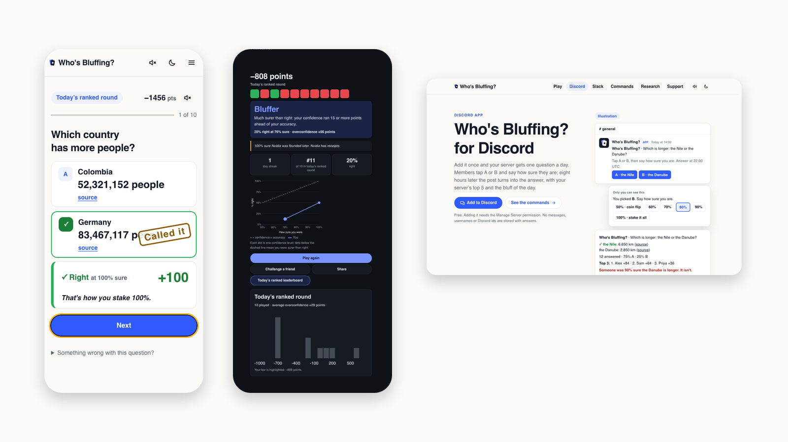

<p align="center">
  <a href="https://whosbluffing.com">
    <picture>
      <source media="(prefers-color-scheme: dark)" srcset="web/public/press/logo-dark.png">
      
    </picture>
  </a>
</p>

<p align="center">A one-minute game that finds out who's bluffing.</p>

<p align="center">
  <a href="https://whosbluffing.com"></a>
  <a href="https://whosbluffing.com/discord"></a>
  <a href="https://whosbluffing.com/slack"></a>
  <a href="https://github.com/rongtnt/whos-bluffing/actions/workflows/ci.yml"></a>
  <a href="LICENSE"></a>
</p>

<p align="center">
  <a href="https://whosbluffing.com"></a>
</p>

Ten comparison questions ("Which is longer: the Nile or the Danube?"). Pick one, then stake how sure you are, from 50% to 100%. The scoring rule pays for honesty: 50% scores nothing, 100% right is +100, 100% wrong is −300. At the end you get your type (Bluffer, Too sure, Spot on, Too modest or Playing it safe), a roast if you earned one, and a link to challenge a friend on the same ten.

## Play

- **Web**: [whosbluffing.com](https://whosbluffing.com). Unlimited ten-question rounds by topic and difficulty.
- **Discord**: one question a day in a channel, a private round with `/bluff play`. [Add it](https://whosbluffing.com/discord).
- **Slack**: the same, with `/bluff`. [Add it](https://whosbluffing.com/slack).
- **Classroom**: a live calibration curve for a class at [/class](https://whosbluffing.com/class). **Full assessment** (5 minutes) at [/test](https://whosbluffing.com/test).

## Why

Most people are surer than they are right. The game shows you by how much, every day, in a minute. It is also a pre-registered study ([prereg/PREREG.md](prereg/PREREG.md)): does daily feedback make people better calibrated? Anonymous answers are released under CC BY-NC 4.0 with a data card. No accounts, no tracking, no ads.

Questions combine sourced authored trivia with Wikidata comparisons. Every answer shows a source, and anyone can flag a question.

## Repository

| Folder | What |
|---|---|
| `web/` | The site and API: Cloudflare Pages Functions, D1, vanilla JS |
| `discord/`, `slack/` | The Discord and Slack apps: Cloudflare Workers, no dependencies |
| `items/`, `daily/` | Authored questions, Wikidata comparisons, and historical round schedules |
| `analysis/` | Pipeline, metric definitions shared by JS and Python, fact checks |
| `prereg/` | The frozen pre-registration |
| `brand/` | Logo kit |

## Run it locally

```bash
cd web && npm install && npm run dev
```

`bash scripts/check.sh` runs every test, the smoke suite and the data guards.

## Licence

Source published, all rights reserved ([LICENSE](LICENSE)): read it, run it locally to check the published research, nothing else without written permission. Data releases are CC BY-NC 4.0. Prior art, gratefully acknowledged: [AnkiCalibrateAddon](https://github.com/JulHeg/AnkiCalibrateAddon) and Clearer Thinking's *Calibrate Your Judgment*.
